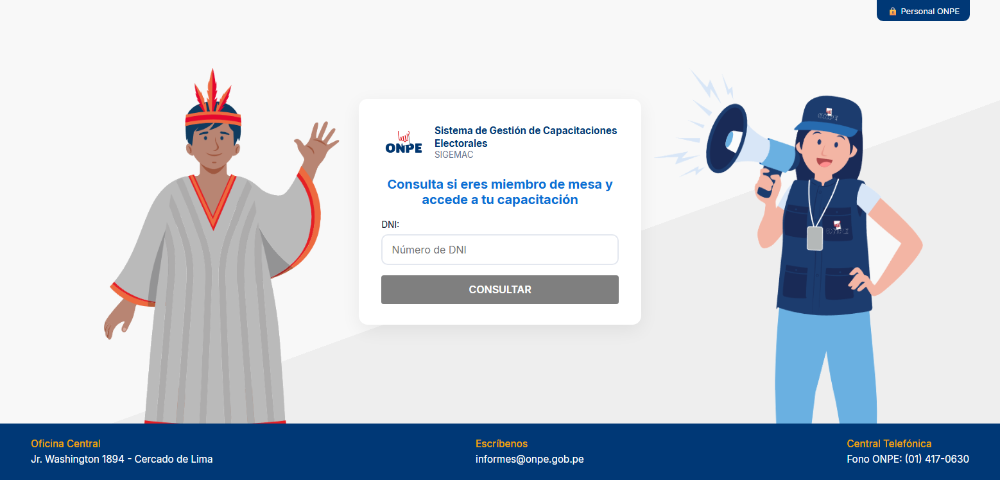
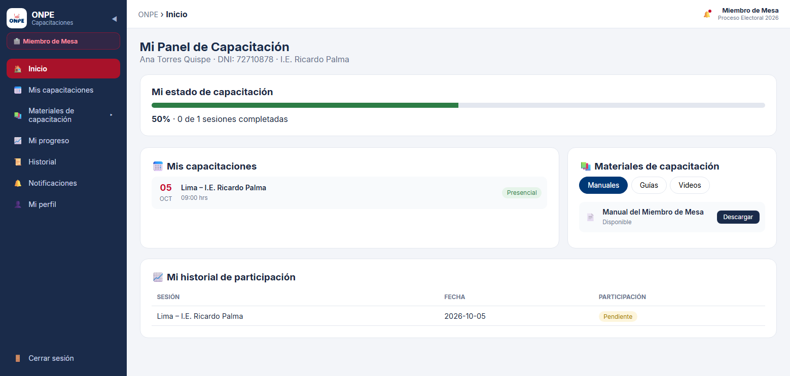

# 🗳️ SIGEMAC - ONPE
> **Sistema de Gestión de Materiales y Capacitación Electoral**

SIGEMAC-ONPE es una solución web integral diseñada para gestionar, monitorear y optimizar la distribución de materiales electorales y la capacitación de miembros de mesa para los procesos electorales liderados por la Oficina Nacional de Procesos Electorales (ONPE).

---

## 📌 Arquitectura del Sistema

El proyecto implementa una arquitectura híbrida desacoplada basada en **Client-Server (REST API)**, complementada por un pipeline end-to-end de **Integración de Datos (ETL)**:


```text
 ┌────────────────────────┐
 │ Google Colab (Python)  │
 │  Pandas (Limpia CSV)   │
 └───────────┬────────────┘
             │
             ▼
 ┌────────────────────────┐      ┌────────────────────────┐
 │   SSIS (Integration)   ├─────►│  SQL Server (Database) │
 │     Carga Masiva       │      └───────────┬────────────┘
 └────────────────────────┘                  │
                                             │ EF Core (Scaffolding)
                                             ▼
 ┌────────────────────────┐      ┌────────────────────────┐
 │  Vanilla JS (Frontend) │◄────►│ .NET Core Web API (C#) │
 │   Peticiones HTTP/JSON │      │   Controladores & DTOs │
 └────────────────────────┘      └────────────────────────┘
```

## 📁 Estructura del Repositorio

```text
SIGEMAC-ONPE/
├── .git/
├── BACKEND/          # Web API en .NET Core (C#) + Entity Framework Core
├── DATABASE/         # Scripts DDL/DML, vistas y procedimientos almacenados en SQL Server
├── ETL/              # Pipelines de datos (Google Colab / Python + Paquetes SSIS)
├── FRONTEND/         # Cliente web dinámico (Vanilla JS, HTML5, CSS3)
├── docs/             # Documentación técnica y recursos gráficos
│   └── assets/       # Capturas de pantalla, diagramas y esquemas
└── README.md         # Documentación principal del proyecto
```

### Detalle de Módulos

* **`BACKEND/`**: API REST desarrollada en **.NET Core (C#)** que utiliza **Entity Framework Core** (`SigemacOnpeContext`)[cite: 2] para la lógica de negocio, autenticación, controladores REST y la capa de acceso a datos.
* **`DATABASE/`**: Objetos relacionales de SQL Server, definición de esquemas, índices y scripts de respaldo.
* **`ETL/`**:
  * **Notebooks (`.ipynb`):** Scripts en Python ejecutados en **Google Colab** utilizando la librería **Pandas** para la limpieza, estructuración, validación de reglas de negocio y exportación de datasets en formato `.csv`.
  * **Paquetes SSIS (`.dtsx`):** Proyectos de **SQL Server Integration Services** orientados al flujo de datos, transformación y automatización de la carga masiva desde los archivos `.csv` procesados hacia la base de datos SQL Server.
* **`FRONTEND/`**: Interfaz de usuario ligera desarrollada con **Vanilla JS (ES6 Modules)**, HTML5 y CSS3.
  * *Modo Híbrido:* Mantenimiento de repositorios cliente (`js/data/Repositories.js`) con capacidad de trabajar en modo desarrollo con datos simulados (`USE_MOCK: true`) o conectarse a la API real vía `ApiClient.js` (`USE_MOCK: false`).
* **`docs/`**: Carpeta destinada al almacenamiento de capturas del sistema, diagramas de arquitectura y manuales de usuario.

---

## 🛠️ Tecnologías Utilizadas

* **Procesamiento de Datos:** Python 3, Pandas, Google Colab
* **Integración de Datos:** SQL Server Integration Services (SSIS)
* **Base de Datos:** SQL Server
* **Backend:** C# (.NET Core Web API), Entity Framework Core[cite: 2]
* **Frontend:** Vanilla JS (ES6 Modules), HTML5, CSS3

---
## 📸 Capturas de Pantalla

| Inicio de Sesión | Panel de Control |
| :---: | :---: |
|  |  |
